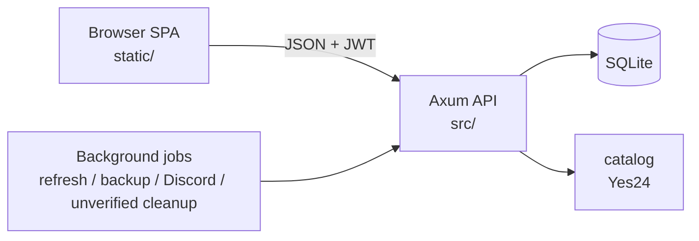
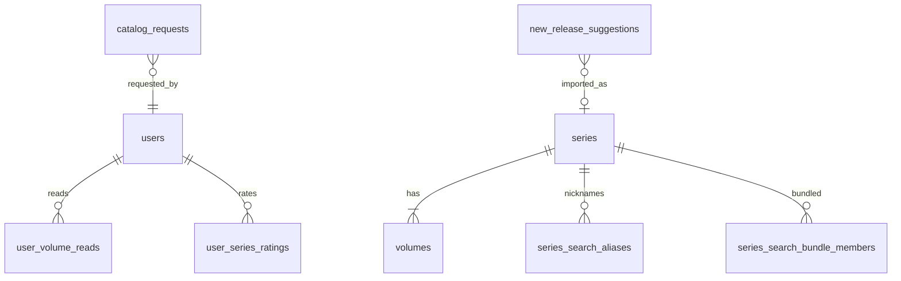
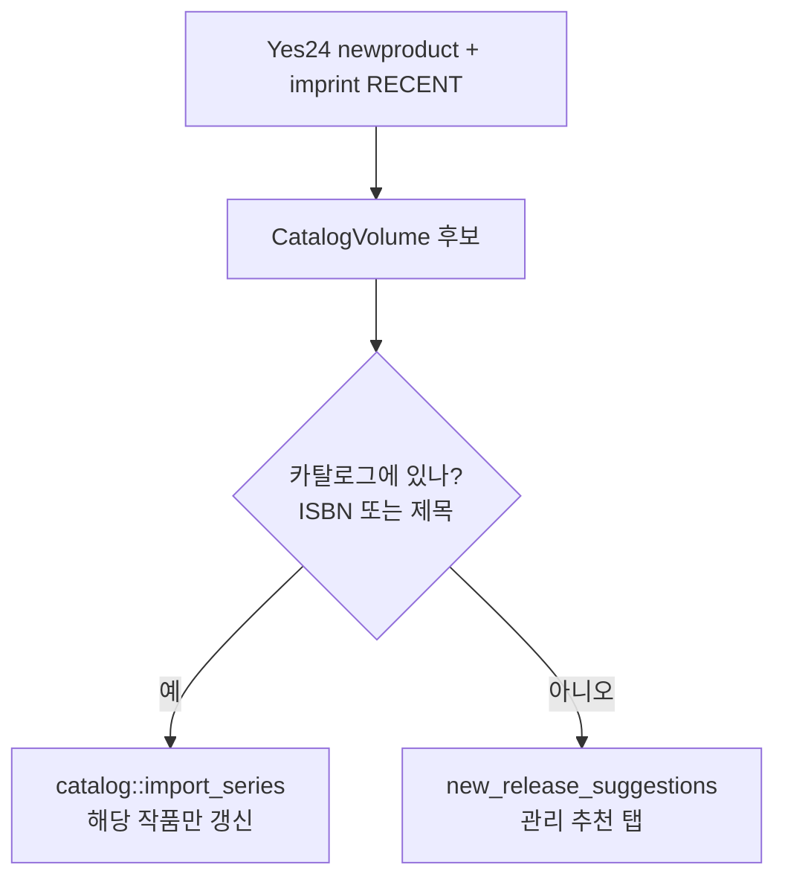

# linvlib 아키텍처

이 문서는 **처음 코드를 연 사람**이 “어디를 보면 되는지” 빠르게 잡도록 작성했습니다.  
도서 API·신간 파이프는 **[CATALOG.md](CATALOG.md)** 를 보세요.

## 한 줄 요약

브라우저 SPA(`static/`) → Axum HTTP API(`src/`) → SQLite(`linvlib.db`) + 도서 공급자(예스24 Open API).



## 실행 시 일어나는 일 (`main.rs`)

1. `.env` / 환경변수로 `Config` 로드  
2. SQLite 연결 + `PRAGMA foreign_keys/WAL`  
3. **`sqlx::migrate!()`** — `migrations/` 적용  
4. `ADMIN_EMAIL` 계정이 있으면 관리자 플래그 보정  
5. 검색용 **자동 별칭** 재구축  
6. 백그라운드 작업 시작  
   - 신간 목록 갱신 (`services/scheduler` → `services/new_releases`)  
   - DB 백업 (`services/backup`)  
   - Discord 상태 (`services/status_report`, 스케줄 신간 갱신 직후)  
   - 미인증 계정 정리 (`services/email` — 인증 토큰 만료 후 삭제, 기동 직후 + 매시간)  
7. `routes::create_router` 로 HTTP 서버 listen  

## 레이어

| 레이어 | 경로 | 역할 |
|--------|------|------|
| Routes | `src/routes/` | URL ↔ 핸들러 연결 |
| Handlers | `src/handlers/` | HTTP 입출력, 인증 extractor |
| Services | `src/services/` | 도메인 로직 (catalog, 신간, 요청 …) |
| Repositories | `src/repositories/` | SQL |
| Models | `src/models/` | serde DTO |
| Auth | `src/auth/` | JWT, `AuthUser` / `AdminUser` |
| Frontend | `static/js/` | 페이지 라우팅 + API 호출 |

**규칙:** 핸들러는 얇게, SQL은 repository, 외부 API·복잡한 규칙은 service.

## 프론트엔드

- 엔트리: `static/js/app.js` + `router.js`  
- 페이지: `static/js/pages/*.js` (admin, import, series-list, series-detail …)  
- API 래퍼: `static/js/api.js`  
- 빌드 스텝 없음 — 파일을 고치면 서버의 `static/` 만 갱신하면 됨  

관리자 화면 탭 예: 상태 / 요청 / **추천** / 직접 등록 / 사용자 / 백업.

## 데이터 모델 (개념)



- `series` / `volumes` — 공유 카탈로그  
- `series_search_aliases` — 줄임말·유저/관리자 별칭 (띄어쓰기·특수문자 무시 매칭)  
- `series_search_bundles` — 본편+외전처럼 **검색 시 같이 나오게** 묶음  
- `catalog_requests` — 사용자 요청 (add / edit / other / search_improve)  
- `new_release_suggestions` — 신간 목록에는 있는데 카탈로그에 없는 후보  

컬럼 `aladin_series_id` / `aladin_item_id` 는 이름을 그대로 둔 외부 식별자입니다. 시리즈 키는 `title:…` 또는 `manual:…`, 권 키는 `isbn:…` / `yes24:…` / `manual-vol:…` 일 수 있습니다.

## 신간 갱신

전량 시리즈 검색 방식은 **폐기**되었습니다. 현재는 예스24 신간·임프린트 최근 출간만 봅니다.



코드:

- 목록 수집: `services/catalog/yes24.rs` → `fetch_new_release_items`  
- 매칭·갱신·추천: `services/new_releases.rs`  
- 수동 실행: `POST /api/v1/admin/refresh` → **즉시** `{ started, already_running, message }` 반환 후 백그라운드 실행 (nginx 타임아웃 회피). 진행 여부는 `GET /admin/status`의 `refresh_running`  
- 스케줄: `services/scheduler.rs` (23:30 KST). 이 실행이 끝나면 Discord 일일 상태를 보냅니다. 관리자 수동 갱신은 보내지 않습니다.  

추천 UI: 관리 → **추천** → 가져오기 / 숨기기.  
상세: [CATALOG.md](CATALOG.md#신간-갱신).

## 검색이 동작하는 방식

앱 **내부** 작품 검색:

1. 제목 `LIKE`  
2. `series_search_aliases` (별칭; 제목·별칭 모두 공백·특수문자 무시)  
3. **작품 묶음**에 들어 있으면 동료 시리즈도 결과에 포함  

관리자 일괄 도구: `/import?tab=aliases` (줄임말 + 묶음).

외부 **가져오기** 검색은 [CATALOG.md](CATALOG.md#가져오기-검색) 참고.

## 카탈로그 요청 흐름

1. 사용자: `/import` 또는 작품 상세에서 요청  
2. DB `catalog_requests` (`pending`)  
3. 관리자: 관리 → **요청**  
   - **승인** = 상태만 변경 (추가 요청은 자동 등록하지 **않음**)  
   - 외부 시리즈 키가 있으면 **가져오기 후 승인**으로 실제 import  
   - 검색 개선 승인 시에만 별칭 반영  
4. 처리된 건은 **요청 기록**에 남음  

## 도서 공급자 모듈

| 함수/모듈 | 용도 |
|-----------|------|
| `catalog::import_search` | 예스24 검색 (LN 필터) |
| `catalog::import_series` | 예스24 import |
| `yes24::fetch_new_release_items` | 신간 리스트 |
| `group::is_catalog_candidate` | LN 후보 판별 |
| `new_releases::refresh` | 신간 기반 카탈로그 갱신 |
| `title_rules` + `config/title_rules.toml` | 제목 정규화·합본 제외 등 |

KST 날짜 헬퍼: `services/quota.rs` (`seoul_today` 등).  
공급자 상세: [CATALOG.md](CATALOG.md).

## 마이그레이션

- 위치: `migrations/001_….sql` …  
- 적용: 프로세스 시작 시 한 번  
- **절대** 이미 적용된 파일의 SQL을 고치지 말 것 (체크섬 → `VersionMismatch` → 서비스 다운)  
- 스키마 변경 = **새 번호 파일 추가**

최근 예:

- `015` 검색 별칭  
- `016` 작품 묶음  
- `017` 신간 추천  
- `018` 수동 시리즈 출처 표기 (`source_label` / `source_url`)  
- `019`–`020` 튜토리얼 완료 플래그 추가 후 제거 (히스토리만 유지)
- `021` 예스24 일일 호출 카운터 `yes24_api_usage` (`CREATE TABLE IF NOT EXISTS`. 이미 적용된 SQL은 수정하지 않음)
- `022` 키 없이 만들어진 `yes24_api_usage`에 `usage_date` 기본키를 맞춤  

## 백그라운드 작업

| Job | 모듈 | 기본 시각 (KST) |
|-----|------|-----------------|
| 신간 갱신 | `scheduler` + `new_releases` | 23:30 |
| DB 백업 | `backup` | 00:00 |
| Discord 상태 | `status_report` | 신간 갱신 직후 |
| 미인증 계정 정리 | `email` | 기동 직후 + 매시간 |

마지막 실행 일자는 `app_meta` 테이블에 저장되어, 낮에 재시작해도 같은 날 중복 실행을 피합니다.  
(미인증 정리는 토큰 만료 시각 기준이며 `app_meta`와 무관하게 동작합니다.)

## 테스트

```bash
cargo test
```

통합 테스트는 `tests/integration_test.rs` (임시 SQLite).

## 관련 문서

- [README.md](../README.md) — 온보딩·환경변수  
- [CATALOG.md](CATALOG.md) — 도서 공급자
- [EMAIL.md](EMAIL.md) — 인증·재설정 메일 템플릿  
- [TUTORIAL.md](TUTORIAL.md) — 첫 로그인 튜토리얼  
- [deploy.md](deploy.md) — 서버 배포  
