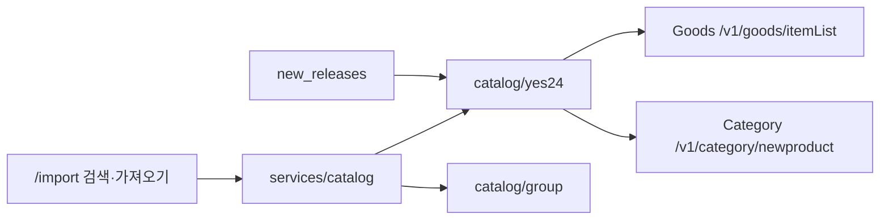

# 도서 카탈로그 · 외부 API

가져오기 검색·신간 갱신이 어떤 공급자를 쓰는지 정리합니다.

## 현황 (2026-09)

| 기능 | 공급자 | 비고 |
|------|--------|------|
| 가져오기 **검색** | 예스24 Goods `itemList` | `services/catalog/yes24` |
| 가져오기 **등록** | 예스24 검색 → 제목 그룹 | LN 후보만 |
| **신간** 목록·갱신 | 예스24 Category `newproduct` + 임프린트 최근 검색 | LN 카테고리·임프린트 |
| 이미 DB에 있는 작품·읽음 | (외부 API 불필요) | |

환경 변수:

| 변수 | 필수 | 설명 |
|------|------|------|
| `YES24_API_KEY` | 예 | 예스24 Open API 키 (`X-Api-Key`) |

호출 한도(Basic): **초당 10회**, **일 20,000회**(KST 자정 리셋). 앱은 슬라이딩 창으로 RPS를 지키고, 일 사용량은 soft **19,500**에서 막습니다. 카운터는 `yes24_api_usage`에 저장되며 관리 상태와, 신간 갱신 직후 Discord 보고에 표시됩니다.

키 발급: [예스24 Developers](https://developers.yes24.com/)

이용 시 [예스24 운영 정책](https://developers.yes24.com/)에 따라 **출처 표기**와 **상품 상세 링크**를 유지합니다.

## 모듈 지도

| 경로 | 역할 |
|------|------|
| `services/catalog` | 검색·가져오기 진입점 (`CatalogItem`) |
| `services/catalog/yes24` | 예스24 검색·신간·import |
| `services/catalog/group` | 제목 그룹핑·LN 필터·권번호·중복 정리 |
| `services/new_releases` | 신간 매칭 → 갱신 / 추천 적재 |
| `config/title_rules.toml` | 제목 정규화·합본 제외·검색 보조 쿼리 |

핸들러는 `catalog::import_search` / `catalog::import_series` 를 호출합니다.

DB 컬럼명 `aladin_series_id` / `aladin_item_id` 는 역사적 이름입니다. 시리즈 키는 `title:…` 또는 `manual:…`, 권 키는 `isbn:…` / `yes24:…` / `manual-vol:…` 일 수 있습니다.

## LN 필터

예스24 `itemList` 에는 라이트노벨 전용 파라미터가 없습니다 (`category`는 BOOK/ALL 등만 지원). 검색·신간 모두 응답 후 `CatalogVolume::is_catalog_candidate` 로 걸러냅니다.

**유지**

- 출판사가 LN 임프린트 (`group::LN_IMPRINTS`)
- 분류명에 「라이트노벨」·「장르소설」·「라이트」

**제외**

- 분류·제목의 만화/코믹 표기 (`[만화]`, `[코믹]` 등)

## 가져오기 검색

1. 예스24 `itemList` (`category=BOOK`, `sort=RELATION`)
2. 결과가 적으면 `category=ALL` 보강, `title_rules` 보조 쿼리
3. LN 후보만 유지 → `title_rules` 로 시리즈 그룹 (`title:…`)
4. 응답 `sources`: `["yes24"]`

## 가져오기 등록

1. 시리즈 키 + 제목으로 예스24 재검색 (동일 LN 필터)
2. 그룹 선택 후 DB upsert
3. 권 식별자: ISBN13이 있으면 `isbn:{isbn13}`, 없으면 `yes24:{itemId}`

## 신간 갱신

매일 **23:30 KST** (또는 관리자 「지금 신간 갱신」). 스케줄 실행이 끝나면 Discord 일일 상태를 한 번 보냅니다(웹훅이 있을 때). 관리자가 직접 돌린 갱신은 보내지 않습니다.

1. LN 카테고리 `newproduct` (`001001008`, `017001063`)
2. LN 임프린트별 `itemList` (`sort=RECENT`) — 최근 ~3일 KST 출간일
3. LN 후보 필터
4. ISBN·제목으로 카탈로그 매칭 → `catalog::import_series` 갱신
5. 없으면 `new_release_suggestions` (관리 → 추천)

자세한 흐름은 [ARCHITECTURE.md § 신간 갱신](ARCHITECTURE.md#신간-갱신).

## 관련 문서

- [ARCHITECTURE.md](ARCHITECTURE.md) — 전체 구조·레이어
- [README.md](../README.md) — 온보딩·환경변수
- [deploy.md](deploy.md) — 서버 env·스케줄
